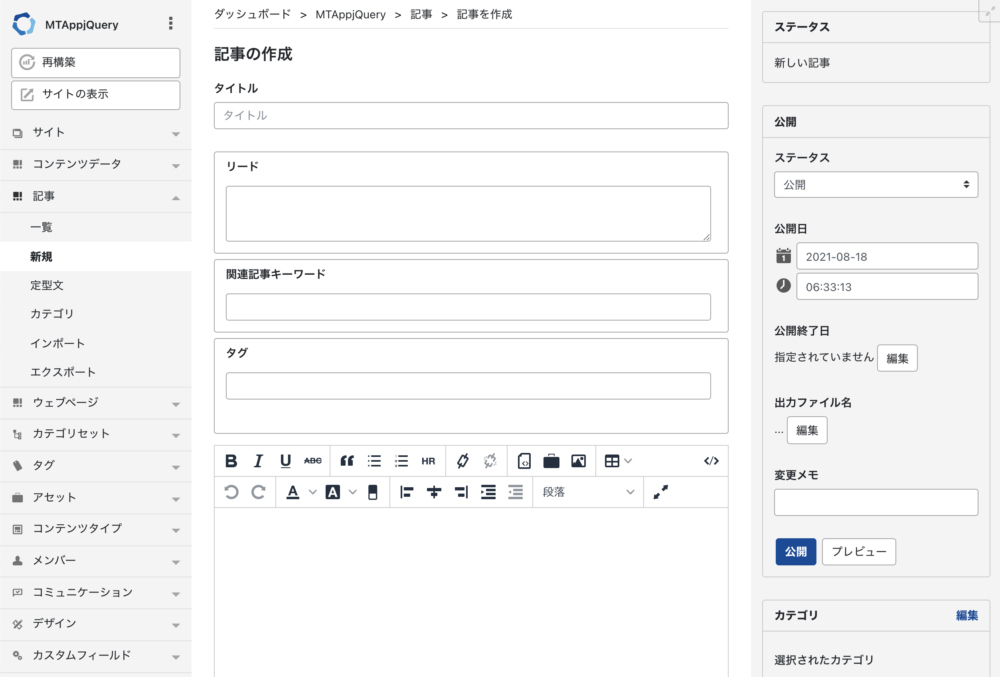
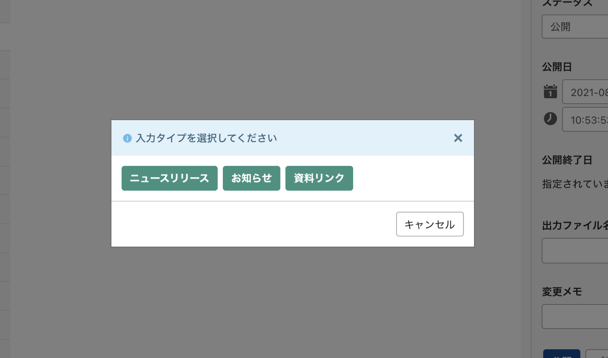
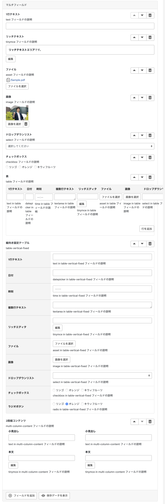
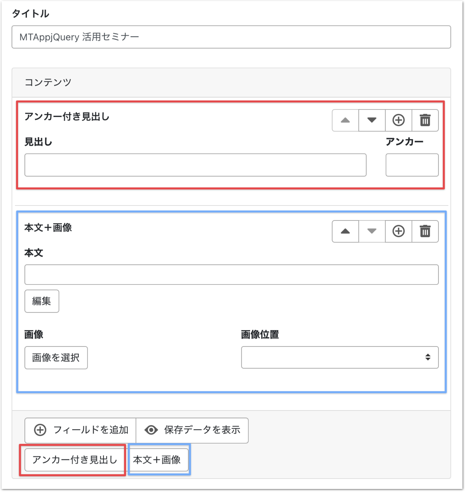
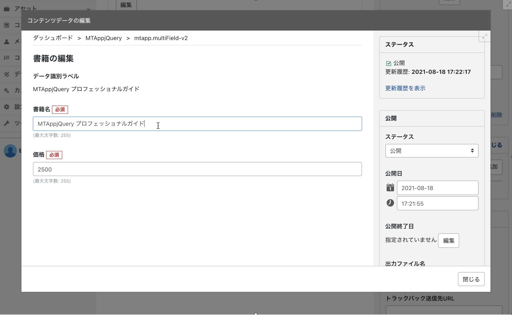
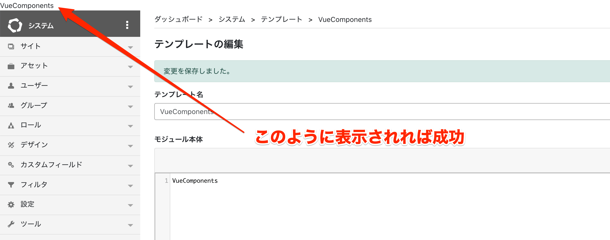
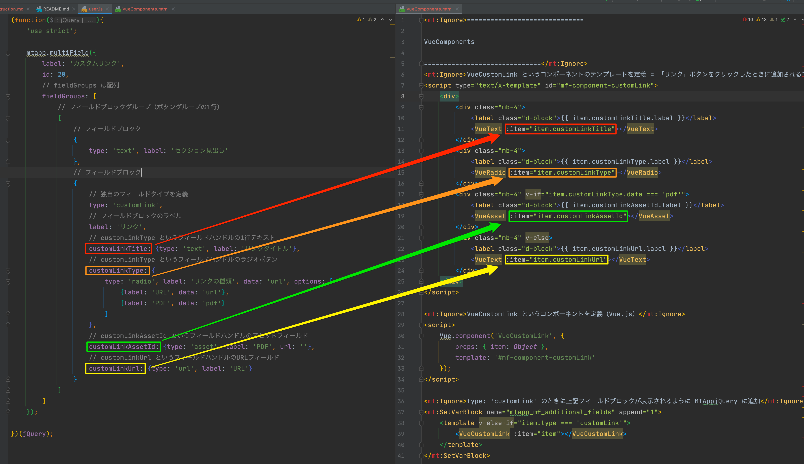

# MTAppjQuery でこう変わる！ MT7 の管理画面をより使いやすくする実践レシピ

## レシピ：書き易い順に並び替えた入力画面



**user.js**

```javascript
(function($){

  if (mtappVars.screen_id === 'edit-entry') {

    // ドラッグ・アンド・ドロップによる並べ替えを無効化
    mtapp.sortDisabled();

    // フィールドの並べ替え
    mtapp.fieldSort({
      sort: 'title,excerpt,keywords,tags,text',
      otherFieldHide: true
    });

    // フィールドをカスタマイズ
    mtapp.customize({
      basename: 'excerpt',
      label: 'リード',
      hint: '一覧画面と詳細画面の上部の囲みの中に表示されます'
    });
    mtapp.customize({
      basename: 'keywords',
      label: '関連記事キーワード',
      hint: '関連記事を表示する際に利用されます'
    });

    // 表示オプションを非表示
    $('#display-options').hide();

    // 本文欄の上に少し余白を追加
    $('#text-field').addClass('mt-4');

    // 「本文・続き」のタブや「フォーマット」を非表示
    $('#editor-header').hide();
  }

})(jQuery);
```

## レシピ：入力タイプによる編集画面切り替え



**user.js**

```javascript
/*
<mt:SetVarBlock name="html">
<button type="button" class="btn btn-success mr-3 mtapp-entry-type" data-type="release">ニュースリリース</button>
<button type="button" class="btn btn-success mr-3 mtapp-entry-type" data-type="info">お知らせ</button>
<button type="button" class="btn btn-success mr-3 mtapp-entry-type" data-type="docs">資料リンク</button>
</mt:SetVarBlock>
*/
(function($){

  if (typeof mtappVars.params.content_type_id !== 'undefined' && mtappVars.params.content_type_id === '1') {

    const $okButton = $('#mtapp-modal-message-ok');

    mtapp.modalMsg({
      type: 'info',
      title: '入力タイプを選択してください',
      content: '<mt:Var name="html" compress="3" escape="javascript" />',
      callbacks: [
        {
          type: 'show.bs.modal',
          action: function () {
            $okButton.html('キャンセル');
          }
        }, {
          type: 'shown.bs.modal',
          action: function () {
            $('.mtapp-entry-type').off('click.buttonAction').on('click.buttonAction', function () {
              const type = $(this).attr('data-type');
              $('body').attr('data-entry-type', type);
              $('#mtapp-modal-message').modal('hide');
            });
          }
        }, {
          type: 'hide.bs.modal',
          action: function () {
            $okButton.html('OK');
          }
        }
      ]
    });

  }

})(jQuery);
```

**user.css**

```css
#data_label-field, #contentField2, #contentField3, #contentField4, #contentField5,
#contentField6, #contentField37, #contentField38, #contentField39 {
  display: none;
}

body[data-entry-type="release"] /*本文*/#contentField2,
body[data-entry-type="release"] /*概要*/#contentField3,
body[data-entry-type="release"] /*og:image*/#contentField4,
body[data-entry-type="release"] /*お問い合わせ先*/#contentField39 {
  display: block;
}
body[data-entry-type="info"] /*本文*/#contentField2,
body[data-entry-type="info"] /*og:image*/#contentField4,
body[data-entry-type="info"] /*タグ*/#contentField5,
body[data-entry-type="info"] /*フォルダ*/#contentField6 {
  display: block;
}
body[data-entry-type="docs"] /*ファイル*/#contentField38 {
  display: block;
}
```

## レシピ：マルチフィールドで自由自在のフィールド設計



**user.js**

```javascript
(function($){

  if (mtappVars.screen_id === 'edit-entry') {

    // ドラッグ・アンド・ドロップによる並べ替えを無効化
    mtapp.sortDisabled();
    $('#display-options').hide();

    // フィールドの並べ替え
    mtapp.fieldSort({
      sort: 'title,customfield_blog_content',
      otherFieldHide: true
    });

    // マルチフィールドを適用
    mtapp.multiField({
      id: 'customfield_blog_content',
      label: 'コンテンツ',
      showAddFieldButton: true,
      showViewRawDataButton: true
    });

  }

})(jQuery);
```

### トッピング：自分好みの入力フィールドを定義



**user.js**

```javascript
(function($){

  if (mtappVars.screen_id === 'edit-entry') {

    // ドラッグ・アンド・ドロップによる並べ替えを無効化
    mtapp.sortDisabled();
    $('#display-options').hide();

    // フィールドの並べ替え
    mtapp.fieldSort({
      sort: 'title,customfield_blog_content',
      otherFieldHide: true
    });

    // マルチフィールドを適用
    mtapp.multiField({
      id: 'customfield_blog_content',
      label: 'コンテンツ',
      showAddFieldButton: true,
      showViewRawDataButton: true,
      fieldGroups: [
        [
          {
            type: 'multi-column', label: 'アンカー付き見出し', options: [
              {type: 'text', label: '見出し', col: 10},
              {type: 'text', label: 'アンカー', col: 2}
            ]
          },
          {
            type: 'multi-column', label: '本文＋画像', options: [
              {type: 'tinymce', label: '本文', rows: 6, col: 12},
              {type: 'image', label: '画像', col: 6},
              {
                type: 'select', label: '画像位置', col: 6, options: [
                  {label: '中央', data: 'center'},
                  {label: '右', data: 'right'},
                  {label: '左', data: 'left'}
                ]
              }
            ]
          }
        ]
      ]
    });

  }

})(jQuery);
```

### トッピング：コンテンツデータとの連携



**user.js**

```javascript
(function($){

  if (mtappVars.screen_id === 'edit-entry') {

    // ドラッグ・アンド・ドロップによる並べ替えを無効化
    mtapp.sortDisabled();
    $('#display-options').hide();

    // フィールドの並べ替え
    mtapp.fieldSort({
      sort: 'title,customfield_blog_content',
      otherFieldHide: true
    });

    // マルチフィールドを適用
    mtapp.multiField({
      version: 1,
      id: 'customfield_blog_content',
      label: 'コンテンツ',
      showAddFieldButton: true,
      showViewRawDataButton: true,
      fieldGroups: [
        [
          {
            type: 'multi-column', label: 'アンカー付き見出し', options: [
              {type: 'text', label: '見出し', col: 10},
              {type: 'text', label: 'アンカー', col: 2}
            ]
          },
          {
            type: 'multi-column', label: '本文＋画像', options: [
              {type: 'tinymce', label: '本文', rows: 6, col: 12},
              {type: 'image', label: '画像', col: 6},
              {
                type: 'select', label: '画像位置', col: 6, options: [
                  {label: '中央', data: 'center'},
                  {label: '右', data: 'right'},
                  {label: '左', data: 'left'}
                ]
              }
            ]
          },
          {
            type: 'contentData',
            label: '書籍',
            siteId: 4,
            contentTypeId: 8,
            radio: false,
            modalEdit: true,
            modalCreate: true,
            includeDraft: true,
            dataLabelName: 'title'
          }
        ]
      ]
    });

  }

})(jQuery);
```

### トッピング：コンディショナルフィールド

- リンクのタイトルを入力
- リンク先を URL で指定するか、アップロードした PDF ファイルにリンクするかを選べる

#### 作成するフィールドの定義を追加

```
(function($){
    'use strict';

    mtapp.multiField({
        label: 'カスタムリンク',
        id: 20,
        // fieldGroups は配列
        fieldGroups: [
            // フィールドブロックグループ（ボタングループの1行）
            [
                // フィールドブロック
                {
                    type: 'text', label: 'セクション見出し'
                },
                // フィールドブロック
                {
                    // 独自のフィールドタイプを定義
                    type: 'customLink',
                    // フィールドブロックのラベル
                    label: 'リンク',
                    // customLinkType というフィールドハンドルの1行テキスト
                    customLinkTitle: {type: 'text', label: 'リンクタイトル'},
                    // customLinkType というフィールドハンドルのラジオボタン
                    customLinkType: {
                        type: 'radio', label: 'リンクの種類', options: [
                            {label: 'URL', data: 'url'},
                            {label: 'PDF', data: 'pdf'}
                        ]
                    },
                    // customLinkAssetId というフィールドハンドルのアセットフィールド
                    customLinkAssetId: {type: 'asset', label: 'PDF', url: ''},
                    // customLinkUrl というフィールドハンドルのURLフィールド
                    customLinkUrl: {type: 'url', label: 'URL'}
                }
            ]
        ]
    });

})(jQuery);
```

`user.js` を書き換えて「保存と再構築」をするとカスタムリンクフィールドが下図のようになます。

- 「セクション見出し」をクリックすると1行テキストフィールドブロックが追加されます。
- 「リンク」をクリックすると空っぽのフィールドブロックが追加されます。


#### `VueComponents` というグローバルテンプレートモジュールを作成

- ブラウザの別タブでシステムメニューを表示
- システムメニューの左サイドメニューの `デザイン > グローバルテンプレート` に移動
- 画面右上のドロップダウンリストで `テンプレートモジュール` を選択したまま `新規作成` をクリック
- テンプレート名とテンプレート本体に `VueComponents` と入れて保存
- 画面左上に `VueComponents` と表示されれば成功



#### `VueComponents` グローバルテンプレートモジュールを編集

カスタムリンク・フィールドブロックの大枠を定義した下記の内容をコピペして保存

```
<mt:Ignore>VueCustomLink というコンポーネントのテンプレートを定義 = 「リンク」ボタンをクリックしたときに追加されるフィールドブロックのテンプレート</mt:Ignore>
<script type="text/x-template" id="mf-component-customLink">
    <div>VueCustomLink</div>
</script>

<mt:Ignore>VueCustomLink というコンポーネントを定義（Vue.js）</mt:Ignore>
<script>
    Vue.component('VueCustomLink', {
        props: { item: Object },
        template: '#mf-component-customLink'
    });
</script>

<mt:Ignore>type: 'customLink' のときに上記フィールドブロックが表示されるように MTAppjQuery に追加</mt:Ignore>
<mt:SetVarBlock name="mtapp_mf_additional_fields" append="1">
    <template v-else-if="item.type === 'customLink'">
        <VueCustomLink :item="item"></VueCustomLink>
    </template>
</mt:SetVarBlock>
```


ポイントは下記の項目を間違えないようにすることです。

- `type` で指定する値と同じものを入れる（赤）
- 上記の `type` で指定する値の先頭に `Vue` をつけてパスカルケースにする（オレンジ）
- `v-else-if` にする（緑）


#### `VueCustomLink` コンポーネントの中身を作成

```
<script type="text/x-template" id="mf-component-customLink">
    <div>
        <div class="mb-4">
            <label class="d-block">{{ item.customLinkTitle.label }}</label>
            <VueText :item="item.customLinkTitle"></VueText>
        </div>
        <div class="mb-4">
            <label class="d-block">{{ item.customLinkType.label }}</label>
            <VueRadio :item="item.customLinkType"></VueRadio>
        </div>
        <div class="mb-4" v-if="item.customLinkType.data === 'pdf'">
            <label class="d-block">{{ item.customLinkAssetId.label }}</label>
            <VueAsset :item="item.customLinkAssetId"></VueAsset>
        </div>
        <div class="mb-4" v-else>
            <label class="d-block">{{ item.customLinkUrl.label }}</label>
            <VueText :item="item.customLinkUrl"></VueText>
        </div>
    </div>
</script>
```



#### テンプレートで出力

```
<mt:SetVarTemplate name="セクション見出し">
    <h2><mt:NestVar name="item.data" /></h2>
</mt:SetVarTemplate>

<mt:SetVarTemplate name="リンク">
    <mt:IfNestVar name="item.customLinkType.data" eq="url">
        <p><a href="<mt:NestVar name='item.customLinkUrl.data'>"><mt:NestVar name="item.customLinkTitle.data" /></a></p>
    <mt:Else>
        <mt:NestVar name="item.customLinkAssetId.data" setvar="asset_id" />
        <mt:Asset id="$asset_id">
            <p><a href="<mt:AssetURL>"><mt:NestVar name="item.customLinkTitle.data" /></a></p>
        </mt:Asset>
    </mt:IfNestVar>
</mt:SetVarTemplate>

<mt:SetVars>
content_type_id =4
content_field_id =20
</mt:SetVars>
<mt:Contents content_type="$content_type_id">
    <mt:ContentField content_field="$content_field_id">
        <mt:ContentFieldValue convert_breaks="0" json_decode="1" setvar="json" />
        <mt:Var name="json" key="items" setvar="items" />
    </mt:ContentField>

    <mt:Foreach name="items" as="item">
        <mt:NestVar name="item.label" setvar="label" />
        <mt:Var name="$label" />
    </mt:Foreach>
</mt:Contents>
```
